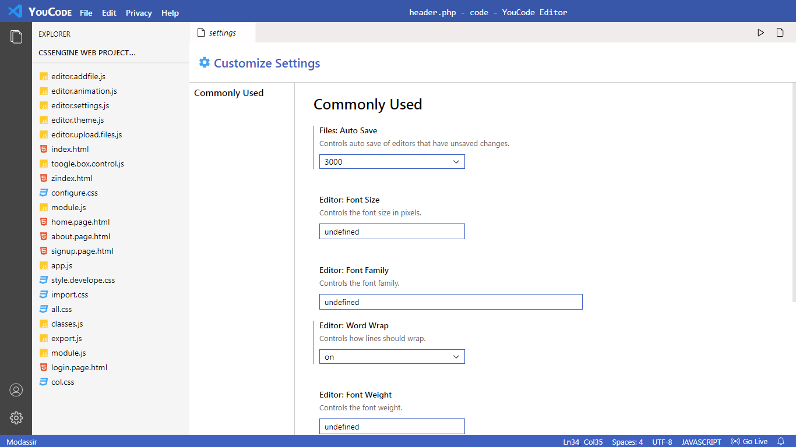
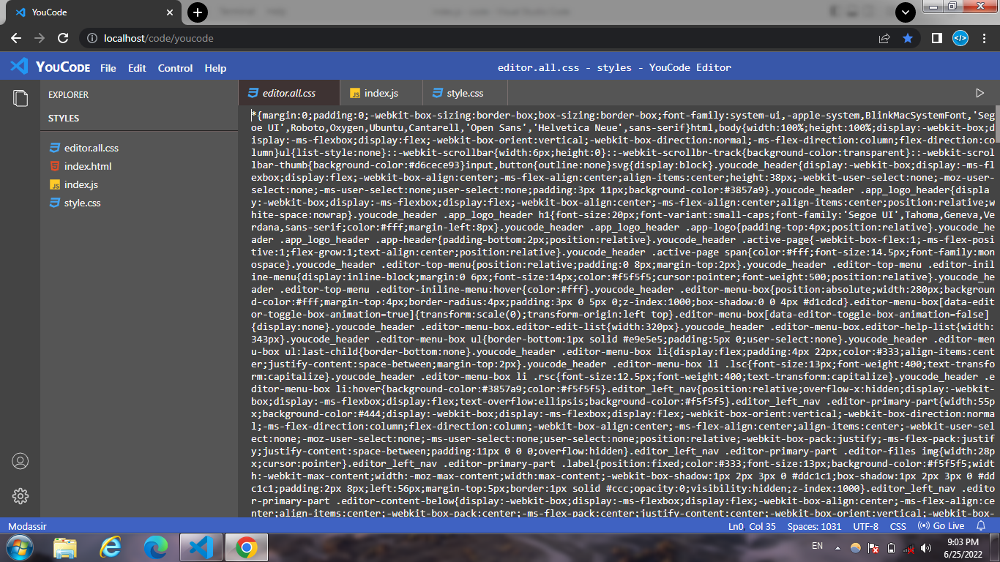
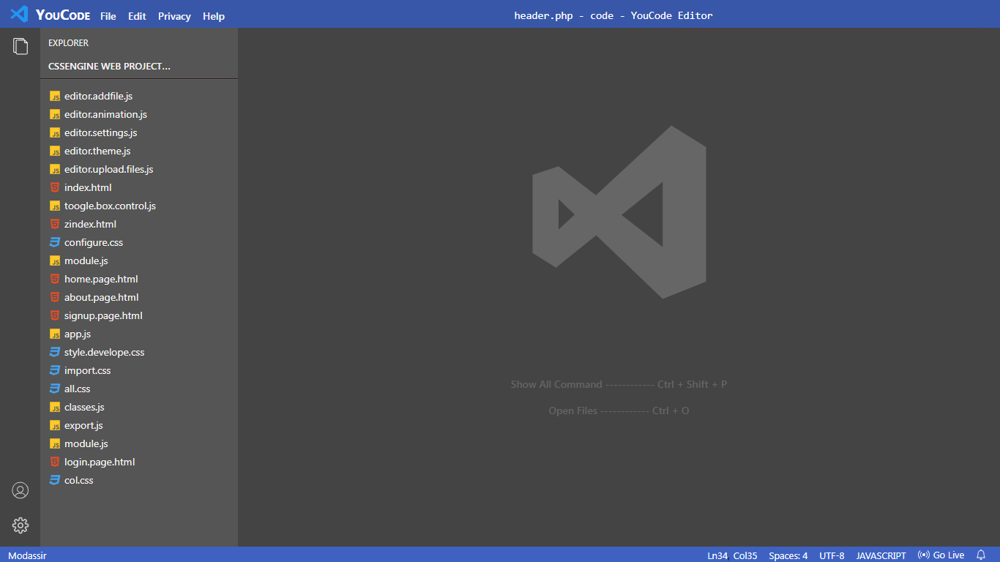
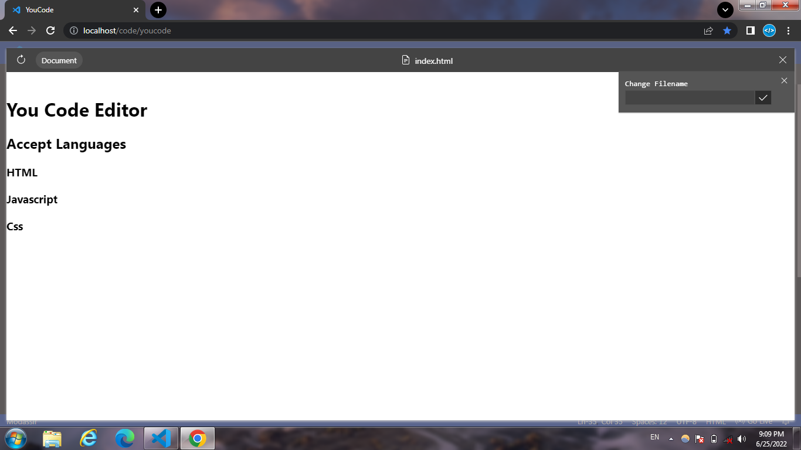

# Youcode Editor
youcode editor is a normal js, css, html accepted/run languages code editor in provided two theme light and dark

# Snapshots
**Light Mode**






**Dark Mode**







# Themes key shortcuts 
```
Ctrl + Shift + K
Ctrl + / # open settings and scroll down page and choose editor theme options
```


# Editor settings json file
```
[
	{
		"editor.theme": "light",
		"editor.autoSave.delay": 3000,
		"editor.animation": true,
		"editor.autoSave": true,
		"editor.wordWrap": true,
		"editor.fontWeight": 500,
		"editor.fontFamily": "Arial sans-serif",
		"editor.fontSize": 14
	}
]
```
